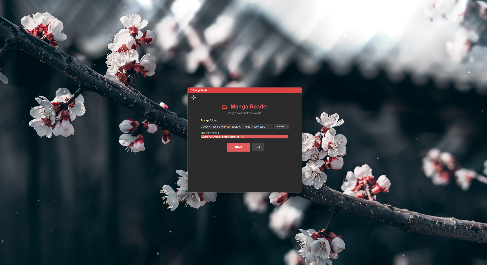

# Manga Reader 📖

A simple, lightweight, and customizable manga reader that lets you easily read your manga collections in a smooth scrolling format.

## Overview

Manga Reader allows you to turn a collection of manga image files (such as `.jpg`, `.jpeg`, `.png`, and other common image formats) stored inside folders into a clean, continuous reading experience.

Instead of opening individual images one by one, Manga Reader automatically detects and organizes your manga pages, displaying them in order as a seamless vertical reading format — similar to reading a PDF or modern web manga viewer.

Simply select your manga folder, and Manga Reader handles the rest.

Main Window:


Manga Viewer:


## Features ✨

- 📚 **Folder-based manga organization**
  - Select a manga folder and automatically load all pages.
  - Supports manga collections stored across multiple folders.

- 📖 **Continuous scrolling reader**
  - Read manga vertically with smooth scrolling.
  - No need to manually open each page.

- 💾 **Reading progress tracking**
  - Automatically remembers:
    - Last manga opened
    - Last page read
    - Reading history

- ⚙️ **Highly customizable**
  - Customize:
    - Scroll speed
    - Zoom level
    - Reading preferences
    - Interface behavior
    - History management

- 🕒 **History management**
  - View previously read manga.
  - Clear history whenever you want.

- 🚀 **Simple and lightweight**
  - Easy to use.
  - Minimal setup.
  - Designed to provide a clean reading experience.

## Installation
1. Download Manga_Reader.py
2. Insure Python is installed on your system.
3. Run using python, in windows 10 or 11 you can just double click the program.


### How to Install Python

If Python is not already installed, you can install the latest version by:

1. Download the installer from offitial Website.
   
      https://www.python.org/downloads

2. If you have winget installed you can use PowerShell.

```powershell
winget install Python.Python.3
```

## Where to find Manga:

1. https://github.com/Jaymax15/Manga_Collection
